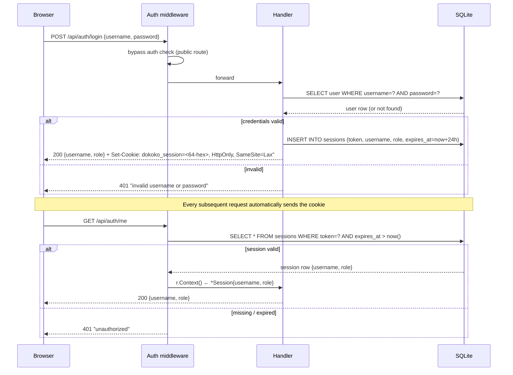
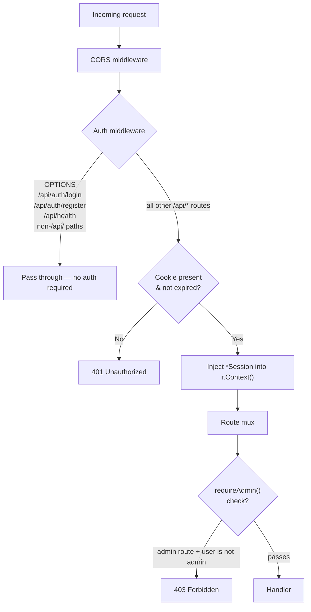
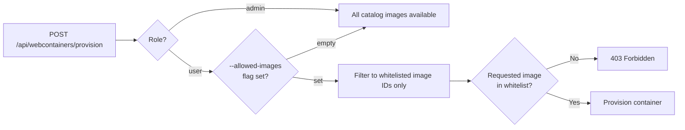
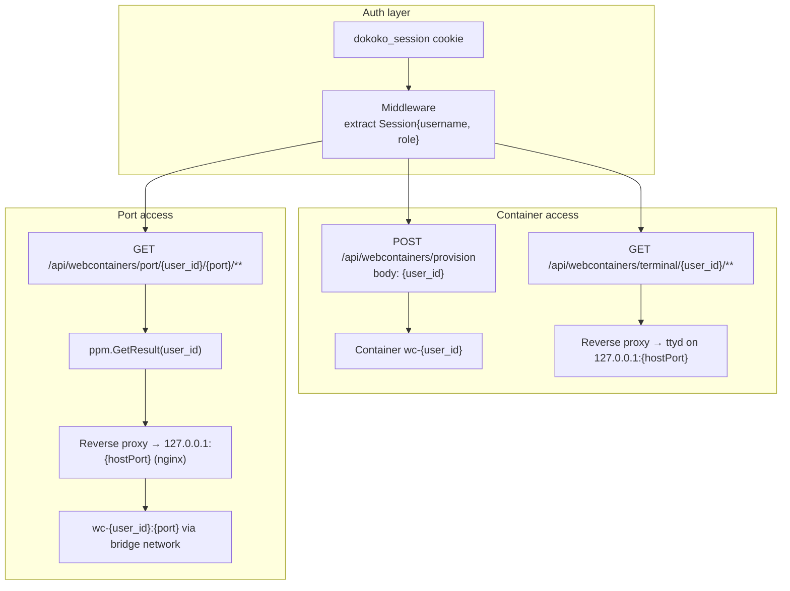
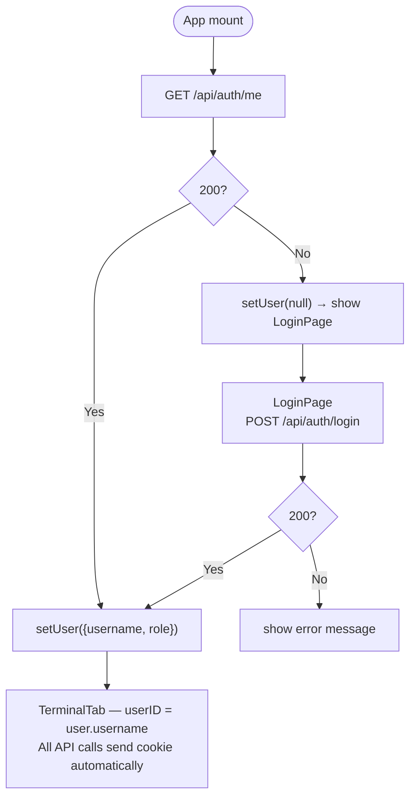
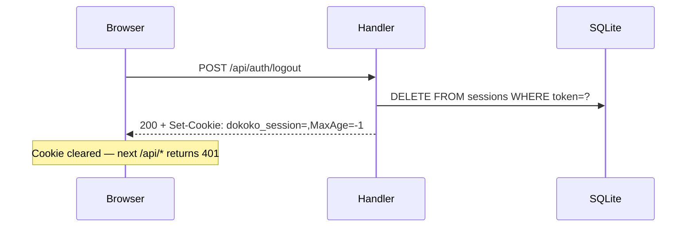

# Authentication & Access Control

## Overview

dokoko uses cookie-based sessions backed by SQLite. Every `/api/*` request
(except login, register, and health) must carry a valid `dokoko_session` cookie.
User identity from that session determines which container a user can provision
and which ports they can access.

---

## Login & session lifecycle



Session tokens are 32 bytes from `crypto/rand` encoded as 64-char hex.
Sessions are stored in SQLite and expire after **24 hours**.

---

## Middleware chain



Handlers retrieve identity with:
```go
sess, _ := sessionFromContext(r.Context())
// sess.Username, sess.Role
```

---

## Role model

| Role | Value | Capabilities |
|---|---|---|
| Admin | `"admin"` | All routes; all catalog images; manage users |
| User  | `"user"`  | Own container only; restricted image catalog; cannot manage other users |

### Admin-only routes

```
GET    /api/users
POST   /api/users
DELETE /api/users/{username}
PUT    /api/users/{username}/password
```

### Image catalog restriction



---

## User identity → container → port access

Every resource is scoped to a **username** (the authenticated user's username
from the session cookie). The container name is derived from it:

```
username  →  SafeContainerName()  →  "wc-" + sanitized_username
```



The `user_id` in all three subtree paths is the authenticated user's own
username — the frontend only ever passes `user!.username` (from the session).

---

## Database schema

```sql
CREATE TABLE users (
    username   TEXT PRIMARY KEY,
    password   TEXT NOT NULL,       -- plain text (local dev tool)
    role       TEXT NOT NULL DEFAULT 'user',
    created_at TEXT NOT NULL
);

CREATE TABLE sessions (
    token      TEXT PRIMARY KEY,    -- 64-char hex, crypto/rand
    username   TEXT NOT NULL REFERENCES users(username) ON DELETE CASCADE,
    role       TEXT NOT NULL,       -- snapshot at login time
    created_at TEXT NOT NULL,
    expires_at TEXT NOT NULL        -- login time + 24 h
);
CREATE INDEX idx_sessions_username   ON sessions(username);
CREATE INDEX idx_sessions_expires_at ON sessions(expires_at);
```

Sessions cascade-delete when a user is deleted.
Role changes take effect at the **next login** (the session carries a snapshot).

---

## Frontend auth flow



The browser sends `dokoko_session` automatically on every same-origin request
(`credentials: 'include'` is set in the API client).  No token header is needed.

---

## Logout


