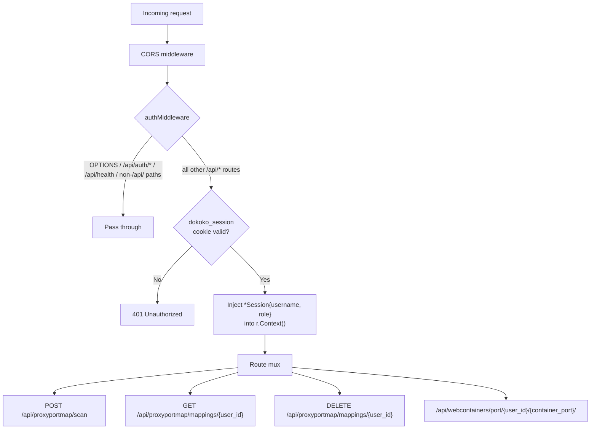
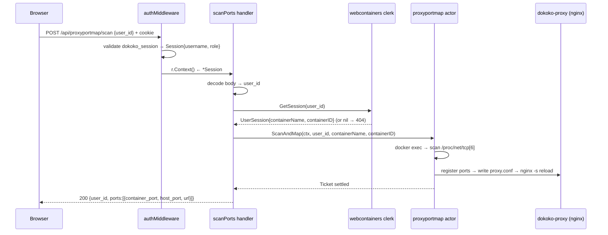
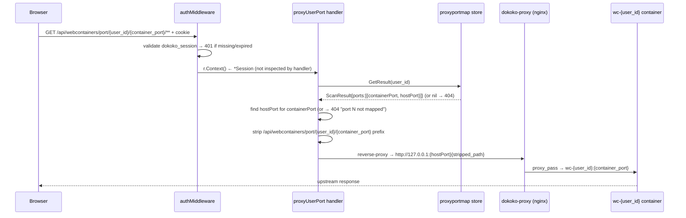
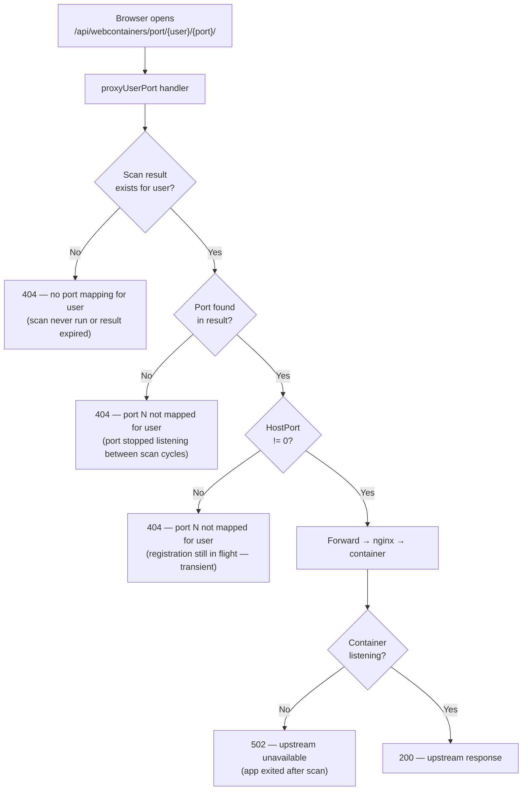
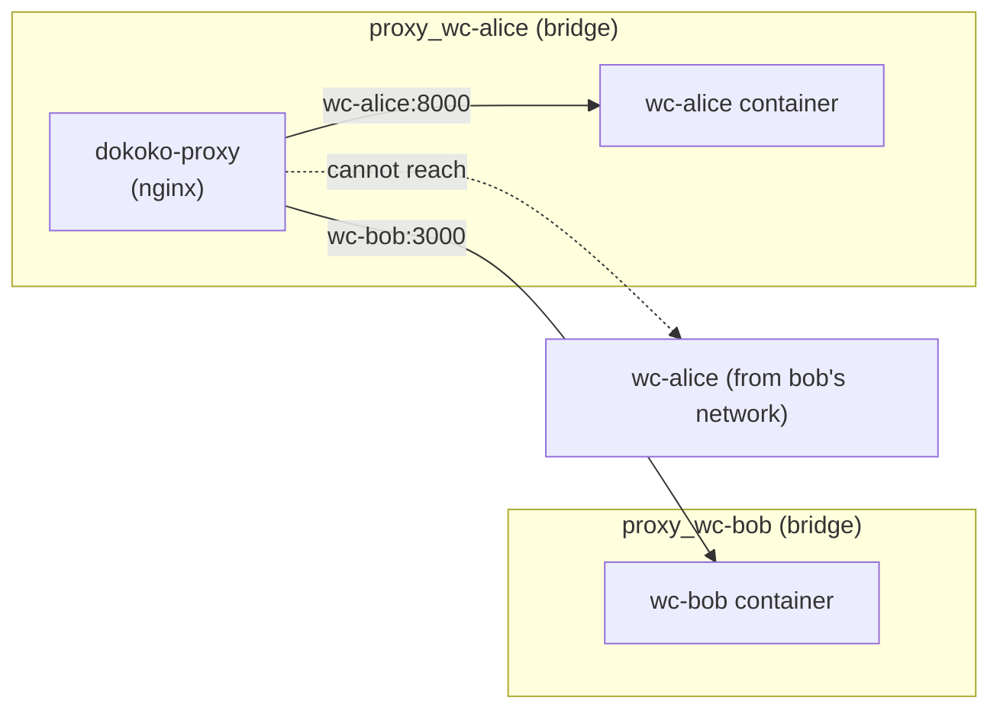

# Port Proxy Access Authorization

## Overview

All port proxy routes sit behind the same cookie-based `authMiddleware` that
guards every `/api/*` endpoint.  A valid `dokoko_session` cookie is required
for every request; missing or expired sessions receive **401 Unauthorized**
before any handler runs.

---

## Middleware chain for port proxy routes



---

## Scan & map flow



> **Note**: the handler does not verify that `user_id` in the body matches the
> session username.  Any authenticated user can request a scan for another
> user's container by supplying a different `user_id`.

---

## Port proxy request flow



---

## Authorization decision matrix

| Route | Auth required | Ownership enforced | Notes |
|---|---|---|---|
| `POST /api/proxyportmap/scan` | Yes (session cookie) | No | Any authenticated user can scan any `user_id` |
| `GET /api/proxyportmap/mappings/{user_id}` | Yes | No | Returns any user's cached mappings |
| `DELETE /api/proxyportmap/mappings/{user_id}` | Yes | No | Any authenticated user can unmap any user's ports |
| `GET /api/webcontainers/port/{user_id}/{port}/` | Yes | No | Proxies to the container named `wc-{user_id}` |

All routes require a valid session.  Ownership (session username == path
`user_id`) is **not** verified server-side — the frontend only ever passes
`user!.username` so cross-user access does not arise in normal use.  This
matches the design of the terminal proxy and webcontainer session routes.

---

## Port unavailability states

A port URL can be valid in the UI but temporarily or permanently unavailable.
There are three distinct causes:



### The transient HostPort=0 window

The most common "port is not available" state occurs during the brief window
between the two store writes inside `ScanAndMap`:

1. **Step 2** — ports discovered; result written immediately with existing
   `HostPort` carried forward from the portproxy store.  For a brand-new port
   this is `HostPort=0`.
2. **Steps 3–4** — proxy container ensured; port registered with nginx; nginx
   reloaded.
3. **Step 5** — result overwritten with real `HostPort` values from the store.

If the browser opens the port URL between steps 2 and 5 (and the port has
never been registered before), `proxyUserPort` finds `HostPort=0` and returns:

```
HTTP 404  port 8000 not mapped for user
```

The next scan cycle (≤ 15 s) resolves this automatically — after step 5 the
`HostPort` is stable and subsequent requests succeed.

### Summary of error responses from proxyUserPort

| Condition | HTTP status | Body |
|---|---|---|
| No session cookie / expired | 401 | `{"error":"unauthorized"}` |
| No scan result for `user_id` | 404 | `no port mapping for user — run scan first` |
| Port not in scan result | 404 | `port N not mapped for user` |
| Port in result but `HostPort=0` (transient) | 404 | `port N not mapped for user` |
| nginx cannot reach container port | 502 | `upstream unavailable` |

---

## Path stripping before upstream

The dokoko web server strips the dokoko path prefix before forwarding, so the
upstream application sees its own URL space:

```
Browser:  GET /api/webcontainers/port/alice/8000/dashboard/index.html
                          │
               strip prefix: /api/webcontainers/port/alice/8000
                          │
nginx (127.0.0.1:8100):  GET /dashboard/index.html
                          │
              proxy_pass → wc-alice:8000/dashboard/index.html
```

WebSocket upgrades are preserved via the `Upgrade` / `Connection` headers set
in the nginx `server {}` block generated by `portproxyconfig.Generate`.

---

## Network isolation

Even though authorization is not checked per-owner, the Docker network
topology provides hard isolation at the transport layer:



Each user container is connected only to its own `proxy_wc-{user}` bridge
network.  nginx routes by host port (`listen 8100`, `listen 8101`, …) and
`proxy_pass` uses the container name, so alice's container is unreachable from
bob's network even if a handler bug forwarded to the wrong host port.
