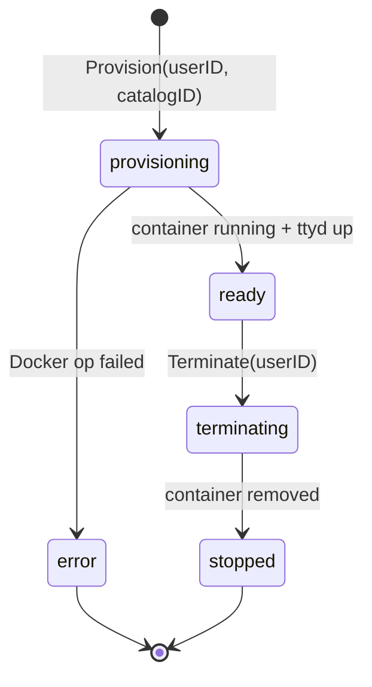
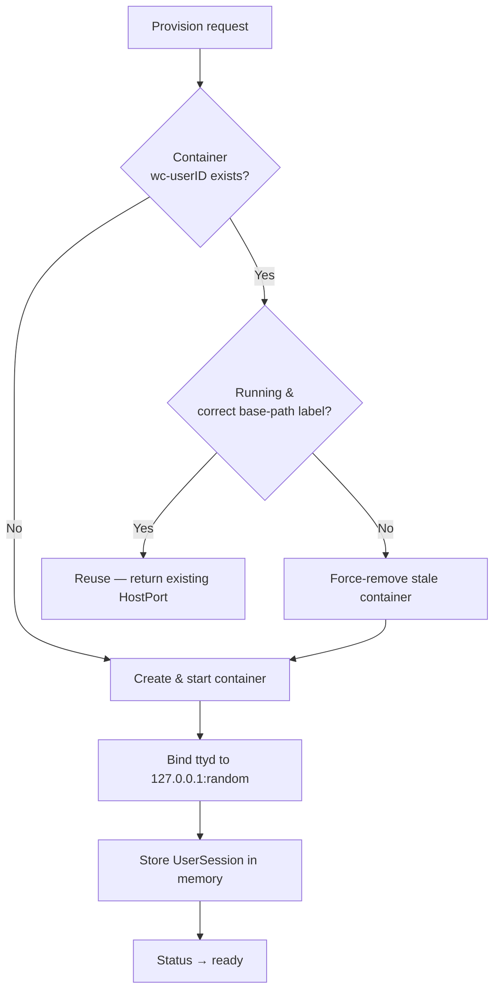
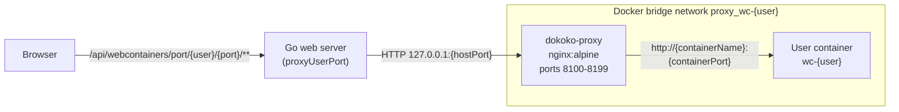
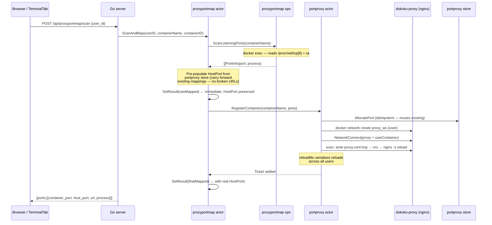
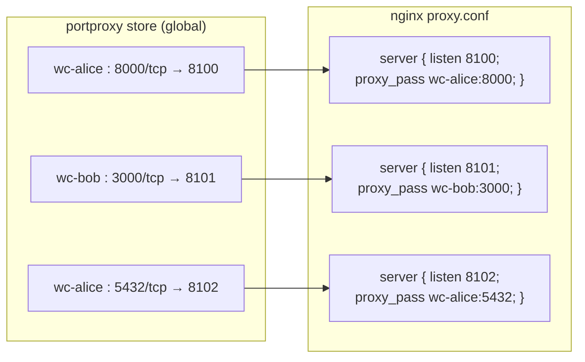

# Session & Port Management

## Container Sessions

Each authenticated user gets one Docker container. The container name is derived
deterministically from the user ID:

```
wc-<sanitized_user_id>     e.g.  wc-admin  /  wc-alice_b
```

Non-alphanumeric characters in the user ID are replaced with `_`.

### Session lifecycle



### Provision decision tree



`HostPort` for ttyd is bound to `127.0.0.1` only — never exposed directly to the
network.  All terminal traffic flows through the dokoko web server.

### Key types

| Type | Package | Description |
|---|---|---|
| `UserSession` | `webcontainers/state` | In-memory record: userID → containerName/ID/hostPort/status |
| `SessionStore` | `webcontainers/state` | Concurrent map keyed by userID |
| `Clerk` | `webcontainers/clerk` | Public API: Provision / Terminate / GetSession |
| `Actor` | `webcontainers/actor` | Async worker queue for container ops |

---

## Port Proxying

User containers can listen on arbitrary TCP ports. dokoko proxies those ports
through a single shared nginx container (`dokoko-proxy`) so the browser only
needs one origin.

### Overall flow



### Port scan & registration



### Host-port allocation



- Host ports 8100–8199 (100 total) are allocated from a global pool.
- `AllocatePort` is idempotent: same container+port always gets the same host port.
- `ReleaseMappingsFor(containerName)` frees all ports when a container is deregistered.

### nginx config generation

`portproxyconfig.Generate(allActiveMappings)` produces one `server {}` block per
active TCP mapping:

```nginx
map $http_upgrade $connection_upgrade { default upgrade; '' close; }

server {
    listen 8100;
    location / {
        proxy_pass         http://wc-alice:8000;
        proxy_http_version 1.1;
        proxy_set_header   Upgrade    $http_upgrade;
        proxy_set_header   Connection $connection_upgrade;
        proxy_read_timeout 3600s;
    }
}
```

The config is written atomically (`proxy.conf.tmp` → `mv` → `proxy.conf`) and
reloads are serialised by `reloadMu` in the portproxy actor to prevent concurrent
writes from multiple users corrupting the file.

### URL routing

```
Browser GET /api/webcontainers/port/alice/8000/index.html
                    │
          proxyUserPort handler
                    │
          ppm.GetResult("alice")       ← look up HostPort
                    │
          ReverseProxy → http://127.0.0.1:8100
                    │
          nginx (listen 8100)          ← strips dokoko prefix
                    │
          proxy_pass → wc-alice:8000/index.html
```

### Isolation guarantees

| Layer | Mechanism |
|---|---|
| Container | Each user owns exactly one `wc-<userID>` container |
| Network | Dedicated bridge `proxy_wc-<userID>` per container; proxy is the only peer |
| Port allocation | Global store keyed by `containerName:port/proto` — no collisions |
| nginx routing | One `server {}` block per host port — no cross-user traffic |
| HTTP path | `{user_id}` in every API path; server looks up only that user's result |
| ttyd binding | `127.0.0.1` only — not reachable without going through the Go server |
